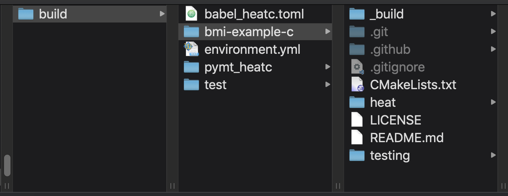

Example: Wrapping a C model
===========================

In this example, we'll use the *babelizer*
to wrap the *heat* model from the `bmi-example-c`_ repository,
allowing it to be run in Python.
The model and its BMI are written in C.
To simplify package management in the example,
we'll use :term:`conda`.
We'll also use :term:`git` to obtain the model source code.

Here are the steps we'll take to complete this example:

#. Create a :term:`conda environment` that includes software to compile the
   model and wrap it with the *babelizer*
#. Clone the `bmi-example-c`_ repository from GitHub and build the
   *heat* model from source
#. Create a *babelizer* input file describing the *heat* model
#. Run the *babelizer* to generate a Python package, then build and install the package
#. Show the *heat* model running in Python through *pymt*

Before we begin,
create a directory to hold our work:

.. code:: bash

  mkdir example-c && cd example-c

This directory is a starting point;
we'll make new directories under it as we proceed through the example.
In the end,
the directory structure under ``example-c`` should look like that in Figure 1.

    Figure 1: Directory structure after completing the C example.

Set up a conda environment
--------------------------

Start by setting up a :term:`conda environment` that includes the *babelizer*,
as well as a toolchain to build and install the model.
The necessary packages are listed in the conda environment file
:download:`environment-c.yml`:

.. include:: environment-c.yml
   :literal:

:download:`Download <environment-c.yml>` this file
and place it in the ``example-c`` directory you created above.
Create the new environment with:

.. code:: bash

  conda env create --file environment-c.yml

When this command completes,
activate the environment
(on Linux and macOS, you may have to use ``source`` instead of ``conda``):

.. code:: bash

  conda activate wrap-c

The *wrap-c* environment now contains all the dependencies needed
to build, install, and wrap the *heat* model.

Build the *heat* model from source
----------------------------------

From the ``example-c`` directory,
clone the `bmi-example-c`_ repository from GitHub:

.. code:: bash

  git clone https://github.com/csdms/bmi-example-c

There are general `instructions`_ in the repository for building and installing
this package on Linux, macOS, and Windows.
We'll augment those instructions
with the note that we're installing into the *wrap-c* conda environment,
so the ``CONDA_PREFIX`` environment variable
should be used to specify the install path.

Linux and macOS
...............

On Linux and macOS,
use these commands to build and install the *heat* model:

.. code:: bash

  cd bmi-example-c
  mkdir build && cd build
  cmake .. -DCMAKE_INSTALL_PREFIX=$CONDA_PREFIX
  make install

Verify the install by testing for the existence of the header
of the library containing the compiled *heat* model:

.. code:: bash

  test -f $CONDA_PREFIX/include/bmi_heat.h ; echo $?

A return of zero indicates success.

Windows
.......

Building on Windows requires
Microsoft Visual Studio 2019 or Microsoft Build Tools for Visual Studio 2019.
To build and install the *heat* model,
the following commands must be run in a `Developer Command Prompt`_:

.. code:: bat

  cd bmi-example-c
  mkdir build && cd build
  cmake .. ^
    -G "NMake Makefiles" ^
    -DCMAKE_INSTALL_PREFIX=%CONDA_PREFIX% ^
    -DCMAKE_BUILD_TYPE=Release
  cmake --build . --target install --config Release

Verify the install by testing for the existence of the header
of the library containing the compiled *heat* model:

.. code:: bat

  if not exist %LIBRARY_INC%\\bmi_heat.h exit 1

Create a *babelizer* configuration file
---------------------------------------

A *babelizer* configuration file provides information to the *babelizer*
about the model to be wrapped.

Typically, we would use the ``babelize sample-config`` command
to create a sample configuration file, which could then be edited.
However, to simplify this example, we have provided a completed
configuration file for the *heat* model.
:download:`Download <babel_heatc.toml>` the file
:download:`babel_heatc.toml` and copy it to the ``build`` directory.

The configuration file looks like this:

.. include:: babel_heatc.toml
   :literal:

For more information on the entries and sections of the *babelizer* configuration file,
see `Input file <./readme.html#input-file>`_.

Wrap the model with the *babelizer*
-----------------------------------

From the ``example-c`` directory,
generate a Python package for the model with the ``babelize init`` command:

.. code:: bash

  babelize init babel_heatc.toml

The results are placed in a new directory, ``pymt_heatc``,
under the current directory.

Before we can build and install the Python package,
we must ensure that the dependencies required by the toolchain,
as well as those required by the model,
as specified in the *babelizer* configuration file,
are satisfied.

Change to the ``pymt_heatc`` directory and install dependencies
into the conda environment:

.. code:: bash

  cd pymt_heatc
  conda install -c conda-forge \
    --file requirements-build.txt \
    --file requirements-library.txt \
    --file requirements-testing.txt \
    --file requirements.txt

Now build and install the Python package with:

.. code:: bash

  pip install --no-build-isolation --editable .

This command sets off a long list of messages,
at the end of which you'll hopefully see:

.. code:: bash

  Successfully installed pymt-heatc

Pause a moment to see what we've done.
Change back to the initial ``build`` directory,
make a new ``test`` directory,
and change to it:

.. code:: bash

  $ cd ..
  $ mkdir test && cd test

Start a Python session and try the following commands:

.. code:: python

  >>> from pymt_heatc import HeatModel
  >>> m = HeatModel()
  >>> print(m.get_component_name())
  The 2D Heat Equation

We've imported the *heat* model,
written in C,
into Python!
Exit the Python session.

At this point,
it's a good idea to run the *bmi-tester* (`GitHub repo <bmi-tester>`_)
over the model.
The *bmi-tester* exercises each BMI method exposed through Python,
ensuring it works correctly.
However, before running the *bmi-tester*,
one last piece of information is needed.
Like all models equipped with a BMI,
*heat* uses a :term:`configuration file` to specify initial parameter values.
Create a configuration file for *heat* at the command line with:

.. code:: bash

  $ echo "1.5, 8.0, 6, 5" > config.txt

or download the file :download:`config.txt <examples/config.txt>`
(making sure to place it in the ``test`` directory).

Run the *bmi-tester*:

.. code:: bash

  $ bmi-test pymt_heatc:HeatModel --config-file=config.txt --root-dir=. -vvv

This command sets off a long list of messages,
ending with

.. code:: bash

  🎉 All tests passed!

if everything has been built correctly.

Add metadata to make a *pymt* component
---------------------------------------

The final step in wrapping the *heat* model
is to add metadata used by the `Python Modeling Tool`_, *pymt*.
CSDMS develops a set of standards,
the `CSDMS Model Metadata`_,
that provides a detailed and formalized description of a model.
The metadata allow *heat* to be run and and :term:`coupled <model coupling>`
with other models that expose a BMI and have been similarly wrapped
with the *babelizer*.

Recall the *babelizer* outputs the wrapped *heat* model
to the directory ``pymt_heatc``.
Under this directory,
the *babelizer* created a directory for *heat* model metadata,
``meta/HeatModel``.
Change back to the ``pymt_heatc`` directory
and view the current metadata:

.. code:: bash

  $ cd ../pymt_heatc
  $ ls meta/HeatModel/
  api.yaml

The file ``api.yaml`` is automatically generated by the *babelizer*.
To complete the description of the *heat* model,
other metadata files are needed, including:

* :download:`info.yaml <examples/info.yaml>`
* :download:`run.yaml <examples/run.yaml>`
* a :download:`templated model configuration file <examples/heat.txt>`
* :download:`parameters.yaml <examples/parameters.yaml>`

`Descriptions`_ of these files and their roles
are given in the CSDMS Model Metadata repository.
Download each of the files using the links in the list above
and place them in the ``pymt_heatc/meta/HeatModel`` directory
alongside ``api.yaml``.

Next, install *pymt*:

.. code:: bash

  $ conda install -c conda-forge pymt

Then start a Python session and show that the *heat* model
can be called through *pymt*:

.. code:: python

  >>> from pymt.models import HeatModel
  >>> m = HeatModel()
  >>> print(m.name)
  The 2D Heat Equation

A longer example,
:download:`pymt_heatc_ex.py <examples/pymt_heatc_ex.py>`,
is included in the documentation.
For easy viewing, it's reproduced here verbatim:

.. include:: examples/pymt_heatc_ex.py
   :literal:

:download:`Download <examples/pymt_heatc_ex.py>` this Python script,
then run it with:

.. code:: bash

  $ python pymt_heatc_ex.py

Summary
-------

Using the *babelizer*, we wrapped the *heat* model, which is written in C.
It can now be called as a *pymt* component in Python.

The steps for wrapping a model with the *babelizer* outlined in this example
can also be applied to models written in C++ and Fortran.

..
   Links

.. _bmi-example-c: https://github.com/csdms/bmi-example-c
.. _instructions: https://github.com/csdms/bmi-example-c/blob/master/README.md
.. _Developer Command Prompt: https://docs.microsoft.com/en-us/dotnet/framework/tools/developer-command-prompt-for-vs
.. _bmi-tester: https://github.com/csdms/bmi-tester
.. _Python Modeling Tool: https://pymt.readthedocs.io
.. _CSDMS Model Metadata: https://github.com/csdms/model_metadata
.. _Descriptions: https://github.com/csdms/model_metadata/blob/develop/README.rst
